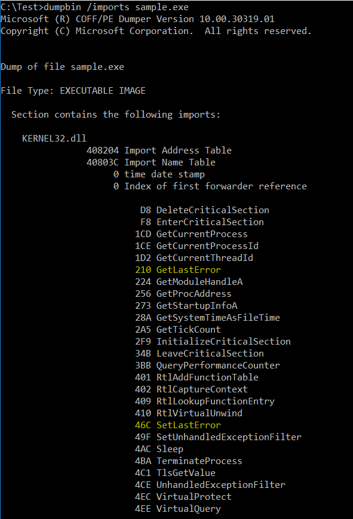
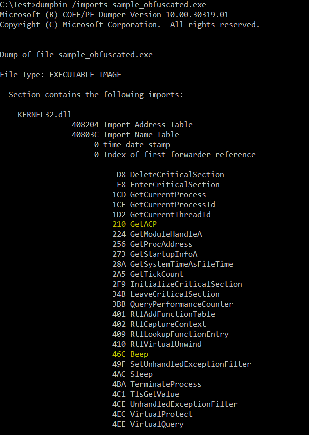
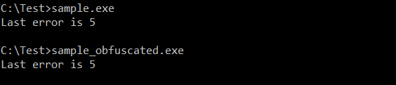
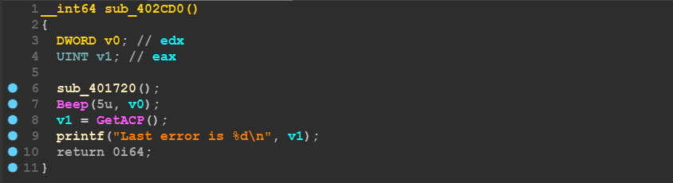
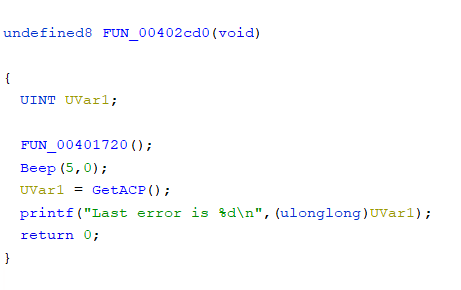
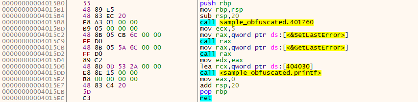

# CallObfuscator
Obfuscate (hide) the PE imports from static/dynamic analysis tools.
# Theory
This's pretty forward, let's say I've used `VirtualProtect` and I want to obfuscate it with `Sleep`, the tool will manipulate the IAT so that the thunk that points to `VirtualProtect` will point instead to `Sleep`, now at executing the file, windows loader will load `Sleep` instead of `VirtualProtect`, and moves the execution to the entry point, from there the execution will be redirected to the shellcode, the tool put before, to find the address of `VirtualProtect` and use it to replace the address of `Sleep` which assigned before by the loader.</br>
# How to use
* It can be included directly as a library, see the following snippet (based on the example), also you can take a look at [cli.cpp](cli/cli.cpp).</br>
```c++
#include <cobf.hpp>

int main() {
	cobf obf_file = cobf("sample.exe");
	obf_file.load_pe();
	obf_file.obf_sym("kernel32.dll", "SetLastError", "Beep");
	obf_file.obf_sym("kernel32.dll", "GetLastError", "GetACP");
	obf_file.generate("sample_obfuscated.exe");
	obf_file.unload_pe();
	return 0;
};
```

* Also can be used as a command line tool by supplying it with the input PE path, the output PE path and optionally the path to the configuration file (default is `config.ini`).</br>
`cobf.exe <input file> <out file> [config file]`</br>
The config file contains the obfuscations needed (dlls, symbols, ...).</br>
Here is a template for the config file content</br>
```ini
; Template for the config file:
; 	* Sections can be written as:
; 		[dll_name]
; 		old_sym=new_sym
;	* The dll name is case insensitive, but 
;	the old and the new symbols are not.
; 	* You can use the wildcard on both the
; 	dll name and the old symbol.
; 	* You can use '#' at the start of
; 	the old or the new symbol to flag 
; 	an ordinal.
;	* The new symbol should be exported
;	by the dll so the windows loader can resolve it.
; For example:
; 	* Obfuscating all of the symbols
;	imported from user32.dll with ordinal 1600.
[user32.dll]
*=#1600
;	* Obfuscating symbols imported from both
;	kernel32.dll and kernelbase.dll with Sleep.
[kernel*.dll]
*=Sleep
;	* Obfuscating fprintf with exit.
[*]
fprintf=exit
```


# Example
Build this code sample</br>
```c++
#include <windows.h>
#include <stdio.h>

int main() {
	SetLastError(5);
	printf("Last error is %d\n", GetLastError());
	return 0;
};
```

After building it, this is how the kernel32 imports look like</br>

</br>

Now let's obfuscate both `SetLastError` and `GetLastError` with `Beep` and `GetACP` (actually any api from kernel32 will be ok even if it's not imported at all).</br>
The used configurations are</br>
```ini
[kernel32.dll]
SetLastError=Beep
GetLastError=GetACP
```
Here is the output (also you can use the library directly as shown above).</br>

</br>

Again let's have a look on the kernel32 imports</br>

</br>

There's no existence of `SetLastError` or `GetLastError`</br>
A confirmation that two files will work properly</br>

</br>

# Impact

IDA HexRays Decompiler</br>

</br>

IDA Debugger</br>

</br>

Ghidra</br>

</br>

ApiMonitor</br>

</br>

That's because all of the static analysis tool depend on what is the api name written at IAT which can be manipulated as shown.</br>
For ApiMonitor, because of using IAT hooking, the same problem exists.</br>

On the other side, for tools like x64dbg the shown api names will only depend on what is actually called (not what written at the IAT).</br>

</br>

# Additional
* Dumping the obfuscated PE out from memory won't deobfuscate it, because the manipulated IAT will be the same.</br>
* The main purpose for this tool is to mess up with the analysis process (make it slower).</br>
* One can obfuscate any imported symbol (by name or by ordinal) with another symbol (name or ordinal).</br>
* The shellcode is executed as the first tls callback to process the obfuscated symbols needed by the other tls callbacks before the entry point is executed.</br>
* The shellcode is shipped as c code, generated when the tool is compiled to facilitate editing it.</br>
* The obfuscated symbols names are being resolved by hash not by name directly.</br>
* The tool disables the relocations and strips any of the debug symbols.</br>
* The tool creates a new rwx section named `.cobf` for holding the shellcode and the other needed datas.</br>
* It can be used multiple times on the same obfuscated PE.</br>
* Tested only on Windows 10 x64.</br>
* Get source with `git clone https://github.com/d35ha/CallObfuscator`.</br>
* Download binaries from the [Release Section](https://github.com/d35ha/CallObfuscator/releases).</br>

# TODO
* Shellcode obfuscation (probably with [obfusion](https://github.com/kgretzky/obfusion)).
* Support the delay-loaded symbols.
* Minimize the created section size.
* Compile time hashing.
* Better testing.
